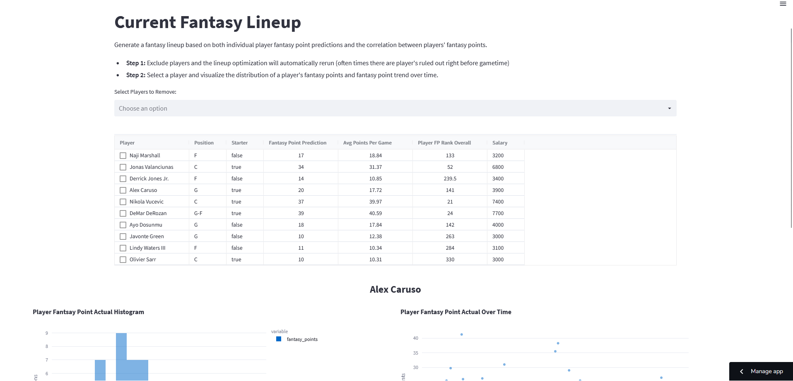

# NBA Daily Fantasy

## Introduction
Creating a winning NBA fantasy lineup requires both: (accurate) fantasy point predictions and a way to create a lineup that maximizes the chances of winning. 
 
 
For fantasy point predictions, we create both a Random Forest and Linear Regression that predicts fantasy points based on rolling lagged player and team stats. We use these fantasy point predictions in the optimization and also require the constraint that at least two correlated players are included in the lineup in order to increase variance thereby increasing the upper range of total expected fantasy points for the lineup.
 
 

## Codebase
### Data Flow

 
 
The project consists of the following python scripts:
 
- **0-get-initial-data:** Pulls initial boxscore data (including advanced stats) starting from 2001 at the game, team and player level from [nba_api](https://github.com/swar/nba_api).
- **1-build-fp-pred-models:** Build Linear Regression and Random Forest models using lagged player and team features (e.g. Player Fantasy Point ranking, Player PACE).
- **2-get-rolling-data:** 
- **3-rolling-model-data-processing:**
- **4-current-season-correlations:**
- **5-streamlit-dash:**

## Streamlit Dash
 [NBA Daily Fantasy Model Dash](https://clumanlan-nba-daily-fantasy-base-model-5-streamlit-dash-p293dc.streamlit.app/)
 

